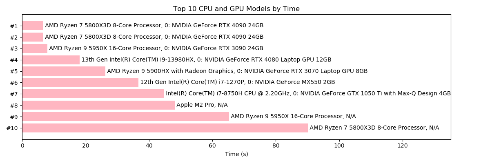

# Juzhen (矩阵)


Juzhen is a set of C++ APIs for matrix operations. It provides a higher level interface for lower-level numerical calculation software like [CBLAS](http://www.netlib.org/blas/) and [CUDA](https://en.wikipedia.org/wiki/CUDA). It supports Neural Net API similar to the ones used in PyTorch or Tensorflow. 

## Example
You can perform matrix operations like this:
```c++
#include <iostream> 
#include "juzhen.hpp"
using namespace std;

MemoryDeleter<float> md1; // it will automatically release all allocated memory

int main(){ 
    // declare matrices like you would in MATLAB or Numpy.
    Matrix<float> A = {"A", {{1,2,3},{4,5,6}}};
    cout << A << endl;
    Matrix<float> B = {"B", {{.1,.2},{.3,.4},{.5,.6}}};
    cout << B << endl << endl;

    cout << log(exp(A*B)+1.0f)/5.0f << endl;
    // no need to release memory by hand. 
}
```
or on GPU:
```c++
#include <iostream> 
#include "juzhen.hpp"
using namespace std;
 
MemoryDeleter<float> md2; 
GPUMemoryDeleter md1; // GPU memory needs its own deleter. 

int main(){
    // cuBLAS initialization ...

    // suppose "handle" is cuBLAS handle.
    cuMatrix A(Matrix<float>("A",{{1,2,3},{4,5,6}}));
    cout << A << endl;
    cuMatrix B(Matrix<float>("B",{{.1,.2},{.3,.4},{.5,.6}}));
    cout << B << endl << endl;

    cout << (log(exp(A*B)+1.0f)/5.0f) << endl;
    
    //free cuBLAS ...
}
```
They both prints out:
```
A 2 by 3
1 2 3 
4 5 6 
B 3 by 2
0.1 0.2 
0.3 0.4 
0.5 0.6 

logM 2 by 2
0.461017 0.571807 
0.981484 1.28033 
```
You can verify the result using MATLAB:
```matlab
>> A = [1,2,3;4,5,6];
>> B = [.1,.2;.3,.4;.5,.6];
>> (log(exp(A*B)+1.0)./5.0)

ans =

    0.4610    0.5718
    0.9815    1.2803

>> 
```

Juzhen (CPU API) also supports matrix slicing: 
```c++
#include <iostream> 
using namespace std;

#include "cpp/juzhen.hpp"

int main() {MemoryDeleter<float> md;
    Matrix<float> A = { "A", {{1,2,3},{4,5,6}} };
    cout << A.columns(0, 2).inv() << endl;
}
```
The code above is the same as the following MATLAB code: 
```matlab
>> A = [1,2,3;4,5,6];
>> inv(A(:,1:2))

ans =

   -1.6667    0.6667
    1.3333   -0.3333
```
You can also use a higher level Neural Net API to write Neural Net applications: 
```c++
// problem set up
const int n = 5000, d = 10, batchsize = 50, numbatches = n / batchsize;

// regression dataset generation
auto X = randn(10, n), beta = randn(10, 1);
auto Y = beta.T() * X + randn(1, n);

auto XT = randn(10, n);
auto YT = beta.T() * XT + randn(1, n);

// define layers
Layer<MatrixF> L0(16, 10, batchsize), L1(4, 16, batchsize);
LinearLayer<MatrixF> L2(1, 4, batchsize);
// least sqaure loss
LossLayer<MatrixF> L3t(n, YT);

// nns are linked lists containing layers
list<Layer<MatrixF>*> trainnn({ &L2, &L1, &L0 }), testnn({ &L3t, &L2, &L1, &L0});

// sgd
int iter = 0;
while (iter < 10000) {
    int batch_id = (iter % numbatches);

    // obtaining batches
    auto X_i = X.columns(batchsize * batch_id, batchsize * (batch_id + 1));
    auto Y_i = Y.columns(batchsize * batch_id, batchsize * (batch_id + 1));

    // forward-backward pass
    forward(trainnn, X_i);
    LossLayer<MatrixF> L3(batchsize, Y_i);
    trainnn.push_front(&L3);
    backprop(trainnn, X_i);
    trainnn.pop_front();

    // print progress
    if (iter % 1000 == 0) {
        cout << "testing loss: " << Juzhen::forward(testnn, XT).elem(0, 0) << endl;
    }

    iter++;
}
```

## Should I use Juzhen?
NO(*). MATLAB or NumPy are popular among data scientists for a reason. 
If you are interested in numerical C++ coding, I recommend [Eigen](https://en.wikipedia.org/wiki/Eigen_(C%2B%2B_library)) or [Armadillo](https://en.wikipedia.org/wiki/Armadillo_(C%2B%2B_library)). 

This software is written with educational purposes in mind. If you still want to use it, please read on. 

## Get Started
1. First, install CBLAS and LAPACK and set environment varibles. 
    - In Ubuntu,  
        ```
        sudo apt install libopenblas-dev liblapack-dev
        ```

    - In Windows, you can download precompiled binaries from [OpenBLAS](https://github.com/xianyi/OpenBLAS/releases/tag/v0.3.19).

    - In MacOS, BLAS and LAPACK are parts of [Acclerate Framework](https://developer.apple.com/documentation/accelerate), comes with XCode. 

2. To use Juzhen without GPU support, copy the "cpp" folder to your C++ project directory and add the header file ```juzhen.hpp```. 

3. Suppose you wrote your code in ```main.cpp```. Compile it using
    ```
    g++ -I cpp/ -D CPU_ONLY -O3 main.cpp -o main.out -llapack -lopenblas 
    ```
    Do not forget to link lapack and BLAS! 

4. If you want to use GPU APIs, you need to install [CUDA](https://developer.nvidia.com/cuda-toolkit) and compile your code using [```nvcc```](https://en.wikipedia.org/wiki/Nvidia_CUDA_Compiler):
    ```
    nvcc -I cpp/ -O3 main.cpp cpp/cudam.cpp cpp/cukernels.cu -o main.out -lcublas -lcurand -llapack -lopenblas 
    ```
    Note that we dropped ```-D CPU_ONLY``` flag. 

## Examples Code:
1. [helloworld-cpu](examples/helloworld.cpp)
2. [helloworld-gpu](examples/helloworld_gpu.cpp)
3. [Binary Logistic Regression using a linear model](examples/logisticregression_simple.cpp).
4. Classifying MNIST digits using one hidden layer neural net (on [CPU](examples/logisticregression_MNIST.cpp)/[GPU](examples/logisticregression_MNIST_GPU.cpp)).
5. [Regression using neural net APIs](examples/helloworld_nn.cpp) (on CPU and GPU).

## Compile and Run Examples:
1. Helloworld CPU
    ```
    make helloworld
    bin/helloworld.out
    ```
2. Helloworld GPU
    ```
    make helloworld-gpu
    bin/helloworld-gpu.out
    ```
3. Simple Logistic Regression
    ```
    make logi-bin
    bin/logi-bin.out
    ```
4. MNIST CPU
    ```
    make logi-cpu
    bin/logi-cpu.out
    ```
5. MNIST GPU
    ```
    make logi-gpu
    bin/logi-gpu.out
    ```
6. Neural Net API CPU
    ```
    make helloworld-nn
    bin/helloworld-nn.out
    ```
7. Neural Net API GPU
    ```
    make helloworld-nn-gpu
    bin/helloworld-nn-gpu.out
    ```
    
## Supported Platforms
- Linux (CPU/GPU)
- MacOS (CPU)
- Windows (CPU/GPU*), you will need to install Visual Studio 2019 to compile the code. 
## ```std::move``` Sementics
Consider the following examples:
1. Copy. 
    ```c++
    Matrix<float> A = {"A",{{1,2},{3,4},{5,6}}}; //A is created. Memory allocated. 
    auto B = A; //B is a copy of A. Extra space allocated for B.
    B.zeros(); //B is zero, but A remains the same.
    ```
2.  Ownership Transfer
    ```c++
    Matrix<float> A = {"A",{{1,2},{3,4},{5,6}}};
    auto B = std::move(A); // Transfer the memory owned by A to B. 
    ```
3. Return Value 
    ```c++
    Matrix<float> A = {"A",{{1,2},{3,4},{5,6}}};
    auto B = exp(A); // New memory allocated for B.  
    B.zeros(); // B is zero, but A is not affected. 
    ```
4.  Sacrificial Intermediate Results
    ```c++
    Matrix<float> A = {"A",{{1,2},{3,4},{5,6}}};
    auto B = exp(std::move(A)); // Using the memory space owned by A to create B. A does not own any memory any more. 
    ```
Allocating memory is expensive, so make good use of ```std::move``` semantics and steal memory from sacrificial intermediate results. 
## Garbage Collection
The allocated memory will not be immediately released, so later computations can reclaim those spaces without calling memory allocation functions. To release the memory before the scope exits, please remember to add a line at the begining of the scope: 
```
MemoryDeleter<T> md1; 
```
where ```T``` is the type of your matrix and add ```GPUMemoryDeleter md1;``` if you are using GPU computation. 
# Profiling 
main.cpp
```c++
#include <iostream>
using namespace std;

#include "cpp/juzhen.hpp"

int main(){MemoryDeleter<float> md;

    Matrix<float> A("A", 500, 1000);
    A.randn();

    {Profiler p; //start the profiler
        for (int i = 0; i < 1000; i++)
        {
            auto &&C = A * A.T();
        }
    }// profiler will automatically stop and print out elapsed time when the current scope exits. 
}
```
Compile and Run:
```bash
$ g++ -I cpp/ -D CPU_ONLY -O3 main.cpp -o main.out -llapack -lopenblas 

$ ./main.out 
Time: 1247.48 ms
Total memory released: 2.86102 MB.
```
Compare it with MATLAB:
```MATLAB
>> A = randn(500,1000,'single');
tic; 
for i=1:1000
C = A*A';
end; 
toc;

Elapsed time is 0.759065 seconds.
```

## Known Issues
1. GPU computation only supports single precision calculation. 
2. Currently, Hadamard multiplication does not support in place transpose on GPU. 
## Benchmark on some CPUs/GPUs
Benchmark using MNIST example, time collected by the built-in profiling tool. 


