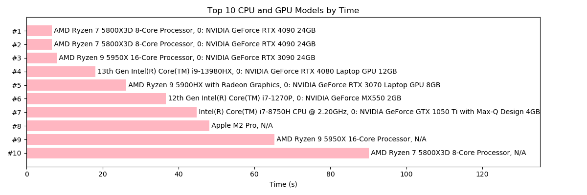

# Juzhen (矩阵)


Juzhen is a set of C++ APIs for matrix operations. It provides a higher-level interface for lower-level numerical calculation software like [CBLAS](http://www.netlib.org/blas/) and [CUDA](https://en.wikipedia.org/wiki/CUDA). It supports a Neural Net API similar to the ones used in PyTorch or TensorFlow, including convolutional layers backed by cuDNN and Metal on Apple Silicon.

Developed under C++20. Supports NVIDIA CUDA 12.x (with cuDNN) and Apple Silicon (Metal).

## Example

Matrix operations on CPU:
```c++
#include <iostream>
#include "cpp/juzhen.hpp"
using namespace std;

int compute(){
    Matrix<float> A = {"A", {{1,2,3},{4,5,6}}};
    Matrix<float> B = {"B", {{.1,.2},{.3,.4},{.5,.6}}};
    cout << log(exp(A*B)+1.0f)/5.0f << endl;
    return 0;
}
```

The same code on GPU — just swap `float` for `CUDAfloat`:
```c++
int compute(){
    Matrix<CUDAfloat> A(Matrix<float>("A",{{1,2,3},{4,5,6}}));
    Matrix<CUDAfloat> B(Matrix<float>("B",{{.1,.2},{.3,.4},{.5,.6}}));
    cout << (log(exp(A*B)+1.0f)/5.0f) << endl;
    return 0;
}
```

Both print:
```
logM 2 by 2
0.461017 0.571807
0.981484 1.28033
```

## Prerequisites

Install CBLAS and LAPACK:
- **Ubuntu/Debian**: `sudo apt install libopenblas-dev liblapack-dev libboost-dev`
- **macOS**: BLAS/LAPACK ship with Xcode (Accelerate framework).
- **Windows**: download precompiled binaries from [OpenBLAS](https://github.com/xianyi/OpenBLAS/releases).

For CUDA builds you also need:
- [CUDA Toolkit](https://developer.nvidia.com/cuda-toolkit) (12.x recommended)
- [cuDNN](https://developer.nvidia.com/cudnn) (required for convolutional layers)

## Building with CMake

Use separate build directories per backend.

### Apple Silicon (Metal) build

```bash
cmake -S . -B build -DAPPLE_SILICON=ON -DNVIDIA_CUDA=OFF
cmake --build build -j
```

### CPU-only build

```bash
cmake -S . -B build_cpu -DAPPLE_SILICON=OFF -DNVIDIA_CUDA=OFF
cmake --build build_cpu -j
```

### NVIDIA CUDA build

```bash
cmake -S . -B build_cuda -DNVIDIA_CUDA=ON
cmake --build build_cuda -j
```

This enables CUDA and automatically searches for cuDNN (in standard paths and the active conda environment). Convolutional layers (`ConvLayer`, `ConvTransLayer`) require cuDNN.

### Running examples

```bash
# basic
./build/helloworld

# MNIST CNN demos
./build_cpu/demo_cnn_mnist_cpu
./build/demo_cnn_mnist_mps
./build_cuda/demo_cnn_mnist_cudnn

# rectified flow on CIFAR-10
./build/demo_cnn_rectified
```

### Running tests

```bash
# after building a backend, run tests in that build directory
ctest --test-dir build --output-on-failure
```

Environment variables for `demo_cnn_rectified`:

| Variable | Default | Description |
|---|---|---|
| `RF_EPOCHS` | 10 | Number of training epochs |
| `RF_BATCH_SIZE` | 128 | Mini-batch size |
| `RF_LR` | 2e-4 | Adam learning rate |
| `RF_EULER_STEPS` | 100 | ODE sampling steps |
| `RF_FID_SAMPLES` | 1000 | Images dumped per epoch for FID |
| `RF_SEED` | 42 | Random seed |

Examples:
```bash
RF_EPOCHS=200 RF_BATCH_SIZE=128 ./build_cuda/demo_cnn_rectified
RF_EPOCHS=10 RF_BATCH_SIZE=128 ./build/demo_cnn_rectified
```

Environment variables for MNIST CNN demos (`demo_cnn_mnist_cpu`, `demo_cnn_mnist_mps`, `demo_cnn_mnist_cudnn`):

| Variable | Default | Description |
|---|---|---|
| `CNN_MNIST_EPOCHS` | 10 | Number of training epochs |
| `CNN_MNIST_SEED` | 43 | Random seed |
| `CNN_MNIST_LOSS_PATH` | backend-specific CSV in `res/` | Output loss CSV path |

Example:
```bash
CNN_MNIST_EPOCHS=10 CNN_MNIST_SEED=43 ./build/demo_cnn_mnist_mps
```

## Examples

| # | Example | Description |
|---|---------|-------------|
| 1 | [helloworld.cu](examples/helloworld.cu) | Basic matrix operations |
| 2 | [helloworld_nn.cu](examples/helloworld_nn.cu) | Regression with Neural Net API |
| 3 | [demo.cu](examples/demo.cu) | Mixed matrix operation demo |
| 4 | [demo_gemm.cu](examples/demo_gemm.cu) | GEMM benchmark/demo |
| 5 | [demo_classification.cu](examples/demo_classification.cu) | Binary logistic regression |
| 6 | [knn.cu](examples/knn.cu) | KNN classification on MNIST |
| 7 | [demo_mnist.cu](examples/demo_mnist.cu) | 10-class logistic regression on MNIST |
| 8 | [pagerank.cu](examples/pagerank.cu) | PageRank demo |
| 9 | [demo_rectified.cu](examples/demo_rectified.cu) | Rectified flow (two Gaussians) |
| 10 | [demo_rectified_infer.cu](examples/demo_rectified_infer.cu) | Rectified flow inference demo |
| 11 | [demo_cnn_mnist_cpu.cpp](examples/demo_cnn_mnist_cpu.cpp) | CNN on MNIST (CPU) |
| 12 | [demo_cnn_mnist_mps.cu](examples/demo_cnn_mnist_mps.cu) | CNN on MNIST (Apple Silicon / Metal) |
| 13 | [demo_cnn_mnist_cudnn.cu](examples/demo_cnn_mnist_cudnn.cu) | CNN on MNIST (CUDA + cuDNN) |
| 14 | [demo_cnn_rectified.cu](examples/demo_cnn_rectified.cu) | Rectified flow on CIFAR-10 (conv UNet) |
| 15 | [demo_gui.cu](examples/demo_gui.cu) | GUI demo |
| 16 | [compute_fid.py](examples/compute_fid.py) | Compute FID score from generated image folders |

## Supported Platforms
- Linux (CPU / NVIDIA GPU)
- macOS (CPU / Apple Silicon via Metal)
- Windows (CPU / NVIDIA GPU — requires Visual Studio 2019+)

## `std::move` Semantics
Consider the following examples:
1. Copy. 
    ```c++
    Matrix<float> A = {"A",{{1,2},{3,4},{5,6}}}; //A is created. Memory allocated. 
    auto B = A; //B is a copy of A. Extra space allocated for B.
    B.zeros(); //B is zero, but A remains the same.
    ```
2.  Ownership Transfer
    ```c++
    Matrix<float> A = {"A",{{1,2},{3,4},{5,6}}};
    auto B = std::move(A); // Transfer the memory owned by A to B. 
    ```
3. Return Value 
    ```c++
    Matrix<float> A = {"A",{{1,2},{3,4},{5,6}}};
    auto B = exp(A); // New memory allocated for B.  
    B.zeros(); // B is zero, but A is not affected. 
    ```
4.  Sacrificial Intermediate Results
    ```c++
    Matrix<float> A = {"A",{{1,2},{3,4},{5,6}}};
    auto B = exp(std::move(A)); // Using the memory space owned by A to create B. A does not own any memory any more. 
    ```
Allocating memory is expensive, so make good use of ```std::move``` semantics and steal memory from sacrificial intermediate results. 
## Garbage Collection
The allocated memory will not be immediately released, so later computations can reclaim those spaces without calling memory allocation functions. To release the memory before the scope exits, please remember to add a line at the begining of the scope: 
```
MemoryDeleter<T> md1; 
```
where ```T``` is the type of your matrix.

# Profiling 
main.cpp
```c++
#include <iostream>
using namespace std;

#include "cpp/juzhen.hpp"

int compute(){

    Matrix<float> A = Matrix<float>::randn(500, 1000);

    {Profiler p; //start the profiler
        for (int i = 0; i < 1000; i++)
        {
            auto &&C = A * A.T();
        }
    }// profiler will automatically stop and print out elapsed time when the current scope exits. 

    return 0;
}
```
Compile and Run:
```bash
$ clang++ -x c++ -I cpp/ -DLOGGING_OFF -D CPU_ONLY -O3 cpp/launcher.cu main.cu -o bin/main.out -llapack -lopenblas  

$ bin/main.out 
Time: 1247.48 ms
Total memory released: 2.86102 MB.
```
Compare it with MATLAB:
```MATLAB
>> A = randn(500,1000,'single');
tic; 
for i=1:1000
C = A*A';
end; 
toc;

Elapsed time is 0.759065 seconds.
```

## Known Issues
1. GPU computation only supports single precision calculation. 
2. Currently, Hadamard multiplication does not support in place transpose on GPU. 
## Benchmark on some CPUs/GPUs
Benchmark using MNIST example, time collected by the built-in profiling tool. 

See: http://statslearning.com:8080/


