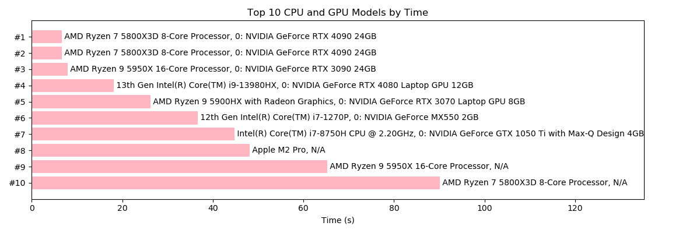

# Juzhen (矩阵)


Juzhen is a set of C++ APIs for matrix operations. It provides a higher-level interface for lower-level numerical calculation software like [CBLAS](http://www.netlib.org/blas/) and [CUDA](https://en.wikipedia.org/wiki/CUDA). It supports a Neural Net API similar to the ones used in PyTorch or TensorFlow, including convolutional layers backed by cuDNN and Metal on Apple Silicon.

Developed under C++20. Supports NVIDIA CUDA 12.x (with cuDNN), Apple Silicon (through Metal Performance Shaders) and ROCm.

## Features

- CPU matrix operations with BLAS, plus CUDA, ROCm/HIP and Metal backends.
- Neural-network layers including convolution, transposed convolution and pre-LayerNorm Transformers.
- Forward-mode Jacobian-vector products (JVP) on CPU, CUDA and ROCm. The JVP correctness suite does not yet cover Metal.
- AMD Transformer forward, backward and JVP paths with batched attention GEMM and fused HIP operations. See the [implementation and validation notes](docs/amd-transformer-optimization.md).
- [Training checkpoints](docs/checkpoint-resume.md) restore model parameters, Adam state, training progress and the host RNG. CPU and AMD tests include restarting in a new process.
- A [CPU linear assignment solver](docs/cpu-assignment.md) using the Hungarian shortest-augmenting-path algorithm, with rectangular and min/max matching support.
- [Reproducible CPU/AMD benchmarks](docs/amd-cpu-benchmark.md), including CPU thread-count comparisons and numerical output checks.

## Example

Matrix operations on CPU:
```c++
#include <iostream>
#include "cpp/juzhen.hpp"
using namespace std;

int compute(){
    Matrix<float> A = {"A", {{1,2,3},{4,5,6}}};
    Matrix<float> B = {"B", {{.1,.2},{.3,.4},{.5,.6}}};
    cout << log(exp(A*B)+1.0f)/5.0f << endl;
    return 0;
}
```

The same code on GPU — just swap `float` for `CUDAfloat`:
```c++
int compute(){
    Matrix<CUDAfloat> A(Matrix<float>("A",{{1,2,3},{4,5,6}}));
    Matrix<CUDAfloat> B(Matrix<float>("B",{{.1,.2},{.3,.4},{.5,.6}}));
    cout << (log(exp(A*B)+1.0f)/5.0f) << endl;
    return 0;
}
```

Both print:
```
logM 2 by 2
0.461017 0.571807
0.981484 1.28033
```

For AMD GPUs, use `Matrix<ROCMfloat>` in a ROCm build in the same way as
`Matrix<CUDAfloat>` above. Use `.to_host()` when a CPU matrix is needed.

### CPU linear assignment

```c++
#include "ml/assignment.hpp"

int compute() {
    Matrix<float> costs("costs", {{4, 1, 3}, {2, 0, 5}, {3, 2, 2}});
    Juzhen::LinearAssignmentSolver solver; // reuse for subsequent problems
    auto result = solver.solve(costs);
    // result.row_to_col == {1, 0, 2}; result.cost == 5
    return 0;
}
```

The solver runs on CPU in every build. It accepts finite costs, supports
`solve(costs, true)` for maximization, and marks unmatched rectangular entries
with `-1`. Use a separate solver instance per concurrent thread.

## Prerequisites

Initialize the repository's submodules before configuring:

```bash
git submodule update --init --recursive
```

CMake also fetches FTXUI on the first configuration. Install CBLAS:
- **Ubuntu/Debian**: `sudo apt install libopenblas-dev libboost-dev`
- **macOS**: BLAS ships with Xcode (Accelerate framework).
- **Windows**: the current CMake configuration uses the bundled `external/OpenBLAS` library and copies its DLL beside the executables.

Alternatively, configure with `-DBLAS_FREE=ON` to build without any external
BLAS: CPU `gemm`/`gemv` then use the handwritten kernels in
`cpp/cpulinalg.hpp`. Slower than OpenBLAS, but dependency-free and validated
against it by the `cpu_linalg` test.

For CUDA builds you also need:
- [CUDA Toolkit](https://developer.nvidia.com/cuda-toolkit) (12.x recommended)
- [cuDNN](https://developer.nvidia.com/cudnn) (required for convolutional layers)

For AMD builds, install a HIP-capable C++ compiler, the HIP runtime, hipBLAS
and rocRAND, and configure the ROCm installation prefix and target GPU
architecture. GPU availability depends on the installed driver and runtime.

## Building with CMake

Use separate build directories per backend.

### Apple Silicon (Metal) build

```bash
cmake -S . -B build -DAPPLE_SILICON=ON -DNVIDIA_CUDA=OFF -DROCM_HIP=OFF -DCMAKE_BUILD_TYPE=Release
cmake --build build -j
```

### CPU-only build

```bash
cmake -S . -B build_cpu -DAPPLE_SILICON=OFF -DNVIDIA_CUDA=OFF -DROCM_HIP=OFF -DCMAKE_BUILD_TYPE=Release
cmake --build build_cpu -j
```

### NVIDIA CUDA build

```bash
cmake -S . -B build_cuda -DNVIDIA_CUDA=ON -DROCM_HIP=OFF -DAPPLE_SILICON=OFF -DCMAKE_BUILD_TYPE=Release
cmake --build build_cuda -j
```

This enables CUDA and automatically searches for cuDNN (in standard paths and the active conda environment). Convolutional layers (`ConvLayer`, `ConvTransLayer`) require cuDNN.

### AMD ROCm/HIP build

Example configuration for a Linux ROCm installation in `/opt/rocm` and a
`gfx1151` GPU. Adjust the compiler path, prefix and architecture for your system:

```bash
cmake -S . -B build_rocm -DROCM_HIP=ON -DNVIDIA_CUDA=OFF -DAPPLE_SILICON=OFF \
  -DCMAKE_BUILD_TYPE=Release -DCMAKE_CXX_COMPILER=/opt/rocm/bin/hipcc \
  -DCMAKE_PREFIX_PATH=/opt/rocm -DROCM_OFFLOAD_ARCH=gfx1151
cmake --build build_rocm -j
```

The AMD tests and benchmarks in the linked reports were run on **Windows,
ROCm 7.1, Radeon 8060S (`gfx1151`)**, with AMD Clang and Visual Studio 2022
Build Tools. For that environment, use PowerShell with the x64 Visual Studio
developer environment initialized, and CMake/Ninja on PATH:

```powershell
$rocmRoot = "$env:ProgramFiles/AMD/ROCm/7.1"
$env:PATH = "$rocmRoot/bin;" + $env:PATH
New-Item -ItemType Directory -Force build_rocm | Out-Null
@'
set(CMAKE_CXX_USING_LINKER_DEFAULT "-fuse-ld=lld")
set(CMAKE_POLICY_DEFAULT_CMP0091 NEW CACHE STRING "Consistent MSVC runtime")
'@ | Set-Content -Encoding ascii build_rocm/compiler-rules.cmake
cmake -S . -B build_rocm -G Ninja -DROCM_HIP=ON -DNVIDIA_CUDA=OFF -DAPPLE_SILICON=OFF `
  -DCMAKE_BUILD_TYPE=Release "-DCMAKE_CXX_COMPILER=$rocmRoot/bin/clang++.exe" `
  "-DCMAKE_PREFIX_PATH=$rocmRoot" -DROCM_OFFLOAD_ARCH=gfx1151 "-DCMAKE_CXX_FLAGS=" `
  "-DCMAKE_USER_MAKE_RULES_OVERRIDE=$PWD/build_rocm/compiler-rules.cmake"
cmake --build build_rocm --target testTransformer testTransformerRef testTransformerTorchDump testJVP testAssignment
```

The local rules file selects the linker accepted by this AMD Clang setup and
keeps dependency runtime settings consistent. This is the configuration tested
here, not a claim of validation on every Windows AMD device or SDK version.

### CMake options

| Option | Default | Description |
|---|---|---|
| `NVIDIA_CUDA` | ON | NVIDIA CUDA backend |
| `ROCM_HIP` | OFF | AMD ROCm/HIP backend |
| `APPLE_SILICON` | OFF | Apple Metal backend |
| `BLAS_FREE` | OFF | Use handwritten CPU GEMM/GEMV without an external BLAS |
| `ROCM_OFFLOAD_ARCH` | empty | Target AMD architecture, e.g. `gfx1151` |

Only one GPU backend may be enabled at a time.

### Running examples

```bash
# basic
./build/helloworld

# MNIST CNN (unified binary – adapts to whichever backend was built)
./build_cpu/demo_cnn_mnist
./build_cuda/demo_cnn_mnist

# rectified flow on CIFAR-10
./build_cuda/demo_cnn_rectified
```

### Running tests

```bash
# after building a backend, run tests in that build directory
ctest --test-dir build --output-on-failure
```

For the AMD Transformer, JVP and CPU assignment checks:

```bash
cmake --build build_rocm --target testTransformer testTransformerRef testTransformerTorchDump testJVP testAssignment
cmake -E make_directory res
ctest --test-dir build_rocm --output-on-failure -R '^(test11|test13|test14|test15|transformer_.*|jvp_correctness|assignment_correctness)$'
```

The PyTorch comparisons need `python3` on PATH with NumPy and PyTorch installed
(CPU PyTorch is sufficient). Test fixtures generate the required dump files.
The dump programs expect the repository's `res` directory to exist; create it
before running them. Missing Python packages cause these comparisons to skip.

AMD checks cover Transformer outputs, input gradients, three steps of parameter
and Adam-state updates, and JVP CPU parity, finite differences and adjoint
consistency. Coverage includes causal/bidirectional attention and short/long
sequences. Assignment tests use exhaustive small-problem references and larger
known optima.

Checkpoint tests exercise CPU or the selected CUDA/ROCm backend, including all
Transformer parameters and Adam states, invalid-file handling and continuation
in a separate process. See [checkpoint usage and limits](docs/checkpoint-resume.md),
especially the distinction between host and device random-number state.

Backend coverage is not identical: `testTransformerParity`, detailed cuDNN
convolution tests and diffusion-score tests still have CUDA-only paths;
Some older
tests return success after printing a skip message, so a passing CTest summary
alone does not establish that every test exercised the GPU. See the linked
validation notes for the checks actually run.

### Benchmarks

```bash
cmake --build build_cpu --target benchmarkCpuGpu benchmarkAssignment
cmake --build build_rocm --target benchmarkCpuGpu benchmarkRocmJVP benchmarkRocmJVPGeneric
python3 tests/benchmarkCpuGpu.py --cpu build_cpu/benchmarkCpuGpu --gpu build_rocm/benchmarkCpuGpu --output res/cpu_gpu_benchmark
./build_cpu/benchmarkAssignment
```

On Windows, append `.exe` to executable paths. The CPU/GPU comparison rotates
execution order, checks outputs, tests multiple CPU thread counts and waits for
GPU completion. Initial input transfers are outside the timed region. Results
depend on workload, build, device and CPU thread configuration.

- [CPU/AMD benchmark methodology and measurements](docs/amd-cpu-benchmark.md)
- [Transformer and JVP optimizations and benchmarks](docs/amd-transformer-optimization.md)
- [CPU assignment API, tests and n≤512 benchmarks](docs/cpu-assignment.md)

## Examples

| # | Example | Description |
|---|---------|-------------|
| 1 | [helloworld.cu](examples/helloworld.cu) | Basic matrix operations |
| 2 | [helloworld_nn.cu](examples/helloworld_nn.cu) | Regression with Neural Net API |
| 3 | [demo.cu](examples/demo.cu) | Mixed matrix operation demo |
| 4 | [demo_gemm.cu](examples/demo_gemm.cu) | GEMM benchmark/demo |
| 5 | [demo_classification.cu](examples/demo_classification.cu) | Binary logistic regression |
| 6 | [knn.cu](examples/knn.cu) | KNN classification on MNIST |
| 7 | [demo_mnist.cu](examples/demo_mnist.cu) | 10-class logistic regression on MNIST |
| 8 | [pagerank.cu](examples/pagerank.cu) | PageRank demo |
| 9 | [demo_rectified.cu](examples/demo_rectified.cu) | Rectified flow (two Gaussians) |
| 10 | [demo_cnn_mnist.cu](examples/demo_cnn_mnist.cu) | CNN on MNIST (all backends) |
| 11 | [demo_cnn_rectified.cu](examples/demo_cnn_rectified.cu) | Rectified flow on CIFAR-10 (conv UNet) |
| 12 | [demo_transformer.cu](examples/demo_transformer.cu) | Character-level transformer LM on enwik8 |
| 13 | [demo_arithmetic.cu](examples/demo_arithmetic.cu) | Transformer that learns integer addition, char by char |
| 14 | [demo_discretediffusion.cu](examples/demo_discretediffusion.cu) | Masked discrete-diffusion char LM on enwik8 (D3PM/MDLM) |
| 15 | [compute_fid.py](examples/compute_fid.py) | Compute FID score from generated image folders |

`demo_transformer` and `demo_discretediffusion` train on `datasets/enwik8` / `datasets/text8`
if present (download instructions in the file headers), falling back to `datasets/corpus.txt`.
The PyTorch mirror scripts used by the parity tests live in `tests/`
(e.g. `tests/demo_transformer.py`, imported by `tests/testTransformerTorch.py`).

### Environment variables

Environment variables for `demo_cnn_rectified`:

| Variable | Default | Description |
|---|---|---|
| `RF_EPOCHS` | 10 | Number of training epochs |
| `RF_BATCH_SIZE` | 128 | Mini-batch size |
| `RF_LR` | 2e-4 | Adam learning rate |
| `RF_EULER_STEPS` | 100 | ODE sampling steps |
| `RF_FID_SAMPLES` | 1000 | Images dumped per epoch for FID |
| `RF_SEED` | 42 | Random seed |

Examples:
```bash
RF_EPOCHS=200 RF_BATCH_SIZE=128 ./build_cuda/demo_cnn_rectified
RF_EPOCHS=10 RF_BATCH_SIZE=128 ./build/demo_cnn_rectified
```

Environment variables for `demo_cnn_mnist`:

| Variable | Default | Description |
|---|---|---|
| `CNN_MNIST_EPOCHS` | 10 | Number of training epochs |
| `CNN_MNIST_SEED` | 43 | Random seed |
| `CNN_MNIST_LOSS_PATH` | backend-specific CSV in `res/` | Output loss CSV path |

Example:
```bash
CNN_MNIST_EPOCHS=10 CNN_MNIST_SEED=43 ./build_cuda/demo_cnn_mnist
```

## Supported Platforms
- Linux (CPU / NVIDIA GPU / AMD GPU via ROCm)
- macOS (CPU / Apple Silicon via Metal)
- Windows (CPU / NVIDIA GPU; AMD ROCm 7.1 was also tested on Radeon 8060S with Visual Studio 2022 Build Tools and AMD Clang)

## `std::move` Semantics
Consider the following examples:
1. Copy. 
    ```c++
    Matrix<float> A = {"A",{{1,2},{3,4},{5,6}}}; //A is created. Memory allocated. 
    auto B = A; //B is a copy of A. Extra space allocated for B.
    B.zeros(); //B is zero, but A remains the same.
    ```
2.  Ownership Transfer
    ```c++
    Matrix<float> A = {"A",{{1,2},{3,4},{5,6}}};
    auto B = std::move(A); // Transfer the memory owned by A to B. 
    ```
3. Return Value 
    ```c++
    Matrix<float> A = {"A",{{1,2},{3,4},{5,6}}};
    auto B = exp(A); // New memory allocated for B.  
    B.zeros(); // B is zero, but A is not affected. 
    ```
4.  Sacrificial Intermediate Results
    ```c++
    Matrix<float> A = {"A",{{1,2},{3,4},{5,6}}};
    auto B = exp(std::move(A)); // Using the memory space owned by A to create B. A does not own any memory any more. 
    ```
Allocating memory is expensive, so make good use of ```std::move``` semantics and steal memory from sacrificial intermediate results. 
## Garbage Collection
The allocated memory will not be immediately released, so later computations can reclaim those spaces without calling memory allocation functions. To release the memory before the scope exits, please remember to add a line at the begining of the scope: 
```
MemoryDeleter<T> md1; 
```
where ```T``` is the type of your matrix.

# Profiling 
main.cpp
```c++
#include <iostream>
using namespace std;

#include "cpp/juzhen.hpp"

int compute(){

    Matrix<float> A = Matrix<float>::randn(500, 1000);

    {Profiler p; //start the profiler
        for (int i = 0; i < 1000; i++)
        {
            auto &&C = A * A.T();
        }
    }// profiler will automatically stop and print out elapsed time when the current scope exits. 

    return 0;
}
```
Compile and Run:
```bash
$ clang++ -x c++ -I cpp/ -DLOGGING_OFF -D CPU_ONLY -O3 cpp/launcher.cu main.cu -o bin/main.out -llapack -lopenblas  

$ bin/main.out 
Time: 1247.48 ms
Total memory released: 2.86102 MB.
```
Compare it with MATLAB:
```MATLAB
>> A = randn(500,1000,'single');
tic; 
for i=1:1000
C = A*A';
end; 
toc;

Elapsed time is 0.759065 seconds.
```

## Known Issues
1. GPU computation only supports single precision calculation. 
2. Currently, Hadamard multiplication does not support in place transpose on GPU. 
## Benchmark on some CPUs/GPUs
Benchmark using MNIST example, time collected by the built-in profiling tool. 

See: http://statslearning.com:8080/



## TF32 tensor-core math (NVIDIA GPUs)

On Ampere or newer NVIDIA GPUs (RTX 30 series+), setting `NVIDIA_TF32=1` routes all
cuBLAS GEMMs through TF32 tensor cores: fp32 storage is unchanged, but multiplies
round the mantissa to 10 bits (accumulation stays full fp32).

```bash
NVIDIA_TF32=1 ./build_cuda/demo_gemm
NVIDIA_TF32=1 ./build_cuda/demo_transformer
```

Measured on an RTX 4090:

| Workload | Speedup |
|---|---|
| `demo_gemm` (5000x5000) | +31% |
| `demo_transformer` (enwik8 char-LM) | +31% |
| `demo_mnist` / `demo_cnn_mnist` (small ops) | none (launch-overhead bound) |

Caveats:
- Off by default. Results deviate from fp32 at the ~1e-3 relative level, which is
  harmless for ML training (loss curves match point-for-point) but fails strict
  numerical-parity tests — run `ctest` without `NVIDIA_TF32` set.
- Convolutions go through cuDNN, which already permits TF32 by default on Ampere+;
  this switch only affects cuBLAS GEMMs.
- CUDA backend only. The ROCm analogue (XF32) exists on Instinct MI200/MI300 but is
  not wired up; Apple Silicon has no TF32 equivalent.
