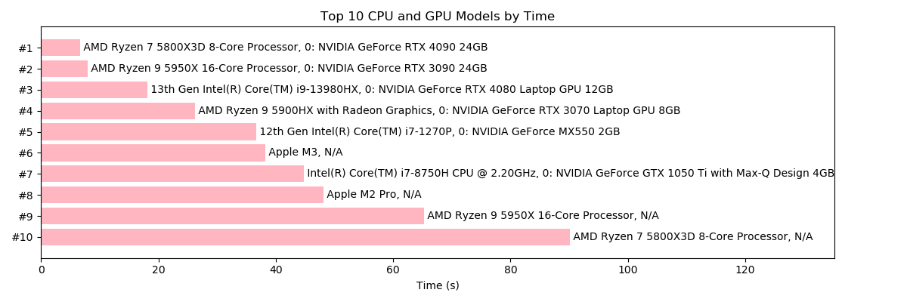

# Juzhen (矩阵)


Juzhen is a set of C++ APIs for matrix operations. It provides a higher level interface for lower-level numerical calculation software like [CBLAS](http://www.netlib.org/blas/) and [CUDA](https://en.wikipedia.org/wiki/CUDA). 

## Example
You can perform matrix operations like this:
```c++
#include <iostream> 
#include "juzhen.hpp"
using namespace std;

MemoryDeleter<float> md1; // it will automatically release all allocated memory

int main(){ 
    // declare matrices like you would in MATLAB or Numpy.
    Matrix<float> A = {"A", {{1,2,3},{4,5,6}}};
    cout << A << endl;
    Matrix<float> B = {"B", {{.1,.2},{.3,.4},{.5,.6}}};
    cout << B << endl << endl;

    cout << log(exp(A*B)+1.0f)/5.0f << endl;
    // no need to release memory by hand. 
}
```
or on GPU:
```c++
#include <iostream> 
#include "juzhen.hpp"
using namespace std;

MemoryDeleter<float> md2;
GPUMemoryDeleter md1; // GPU memory needs its own deleter. 

int main(){ 
    // cuBLAS initialization ...

    // suppose "handle" is cuBLAS handle.
    cuMatrix A(handle, Matrix<float>("A",{{1,2,3},{4,5,6}}));
    cout << A << endl;
    cuMatrix B(handle, Matrix<float>("B",{{.1,.2},{.3,.4},{.5,.6}}));
    cout << B << endl << endl;

    cout << (log(exp(A*B)+1.0f)/5.0f) << endl;
    
    //free cuBLAS ...
}
```
They both prints out:
```
A 2 by 3
1 2 3 
4 5 6 
B 3 by 2
0.1 0.2 
0.3 0.4 
0.5 0.6 

logM 2 by 2
0.461017 0.571807 
0.981484 1.28033 
```
You can verify the result using MATLAB:
```matlab
>> A = [1,2,3;4,5,6];
>> B = [.1,.2;.3,.4;.5,.6];
>> (log(exp(A*B)+1.0)./5.0)

ans =

    0.4610    0.5718
    0.9815    1.2803

>> 
```

Juzhen (CPU API) also supports matrix slicing: 
```c++
#include <iostream> 
using namespace std;

#include "cpp/juzhen.hpp"

int main() {MemoryDeleter<float> md;
    Matrix<float> A = { "A", {{1,2,3},{4,5,6}} };
    cout << A.columns(0, 2).inv() << endl;
}
```
The code above is the same as the following MATLAB code: 
```matlab
>> A = [1,2,3;4,5,6];
>> inv(A(:,1:2))

ans =

   -1.6667    0.6667
    1.3333   -0.3333
```

## Examples Code:
1. [helloworld-cpu](examples/helloworld.cpp)
2. [helloworld-gpu](examples/helloworld_gpu.cpp)
3. [Binary Logistic Regression using a linear model](examples/logisticregression_simple.cpp).
4. Classifying MNIST digits using one hidden layer neural net (on [CPU](examples/logisticregression_MNIST.cpp)/[GPU](examples/logisticregression_MNIST_GPU.cpp)).

## Compile and Run Examples:
1. Helloworld CPU
    ```
    make helloworld
    bin/helloworld.out
    ```
2. Helloworld GPU
    ```
    make helloworld-gpu
    bin/helloworld-gpu.out
    ```
3. Simple Logistic Regression
    ```
    make logi-bin
    bin/logi-bin.out
    ```
4. MNIST CPU
    ```
    make logi-cpu
    bin/logi.out
    ```
5. MNIST GPU
    ```
    make logi-gpu
    bin/logi-gpu.out
    ```
## Supported Platforms
- Linux (CPU/GPU)
- MacOS (CPU)
- Windows (CPU/GPU*), you will need to install Visual Studio 2019 to compile the code. 
## ```rvalue``` and ```lvalue``` Sementics
Consider the following three examples:
1. ```c++
    Matrix<float> A = {"A",{{1,2},{3,4},{5,6}}}; //A is created. Memory allocated. 
    auto B = A; //B is a copy of A. Extra space allocated for B.
    B.zeros(); //B is zero, but A remains the same.
    ```
2.  ```c++
    Matrix<float> A = {"A",{{1,2},{3,4},{5,6}}};
    auto B = std::move(A); //Both B and A owns the same matrix. No extra memory space allocated. 
    B.zeros(); //A and B are both zero matrices now. 
    ```
3. ```c++
    Matrix<float> A = {"A",{{1,2},{3,4},{5,6}}};
    auto B = exp(A); // B steals the memory space from the temporary exp(A). 
    B.zeros(); // B is zero, but A is not affected. 
    ```
Allocating memory is expensive, so make good use of ```std::move``` sementics and steal memory from sacrificial intermediate results. 
## Garbage Collection
The allocated memory spaces will not be automatically released, so later computations can directly claim those spaces without calling expensive memory allocation functions. To release memory, please remember to add a line at the begining of the scope: 
```
MemoryDeleter<T> md1; 
```
where ```T``` is the type of your matrix and ```GPUMemoryDeleter md1;``` if you are using GPU computation. 

## Known Issues
1. GPU computation on Windows is ~2.5 time slower than on Linux. I am not sure the cause of this. 
    - Tested on CUDA 11.5, Windows 11. 
    - Tested it on Native Windows and WSL2. Results are the same. 
2. Currently, Juzhen only supports single precision float point CBLAS/cuBLAS, although it is very easy to modify the source code and add supports for other types of data. 
## Benchmark on some CPUs/GPUs
Benchmark using MNIST example, time collected by the built-in profiling tool. 


